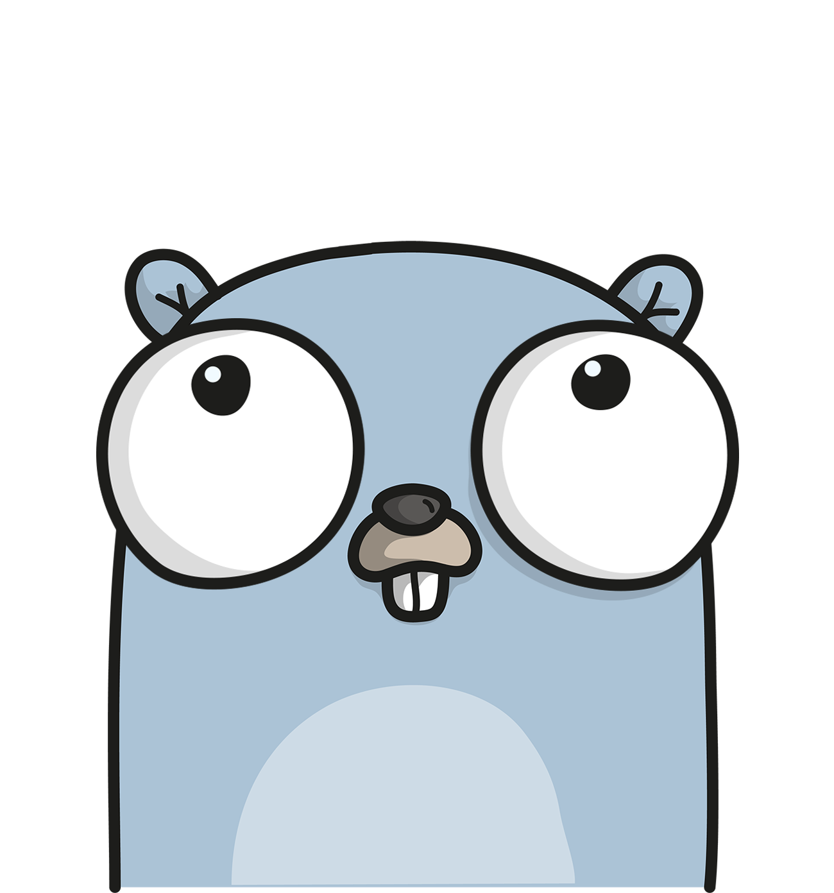

<br/>
<p align="center">
  <a href="https://github.com/yzaimoglu/base">
    
  </a>

  <h3 align="center">Base</h3>

  <p align="center">
    A preconfigured extended Pocketbase app with Gomponents as a Frontend to use in future applications
    <br/>
    <br/>
    <a href="https://github.com/yzaimoglu/base/issues">Report Bug</a>
    .
    <a href="https://github.com/yzaimoglu/base/issues">Request Feature</a>
  </p>
</p>

  

## Table Of Contents

* [About the Project](#about-the-project)
* [Built With](#built-with)
* [Getting Started](#getting-started)
  * [Prerequisites](#prerequisites)
* [Roadmap](#roadmap)
* [Contributing](#contributing)
* [License](#license)
* [Acknowledgements](#acknowledgements)

## About The Project


* Work in Progress

## Built With

We are using [Go](https://go.dev), [Pocketbase](https://pocketbase.io), [Otter](https://github.com/maypok86/otter), [Gomponents](https://www.gomponents.com/), [Tailwind](https://tailwindcss.com/), [Alpine](https://alpinejs.dev/) and [HTMX](https://htmx.org/).

## Getting Started

This is an example of how you may give instructions on setting up your project locally.
To get a local copy up and running follow these simple example steps.

### Prerequisites

This is an example of how to list things you need to use the software and how to install them.

* make
* go 
* npm

```sh
Installation instructions will follow
```

## Roadmap

See the [open issues](https://github.com/yzaimoglu/base/issues) for a list of proposed features (and known issues).

## Contributing

We appreciate everyone who wants to contribute. In order to do so take a look at the issues tab and work on one of the issues. You can then create a pull request:

### Creating A Pull Request

1. Fork the Project
2. Create your Feature Branch (`git checkout -b feature/AmazingFeature`)
3. Commit your Changes (`git commit -m 'Add some AmazingFeature'`)
4. Push to the Branch (`git push origin feature/AmazingFeature`)
5. Open a Pull Request

## License

Distributed under the BSD-3 License. See [LICENSE](https://github.com/yzaimoglu/base/blob/master/LICENSE) for more information.

## Acknowledgements

* [Go](https://go.dev)
* [Pocketbase](https://pocketbase.io)
* [Otter](https://github.com/maypok86/otter)
* [Gomponents](https://www.gomponents.com/)
* [Tailwind](https://tailwindcss.com/)
* [Alpine](https://alpinejs.dev/)
* [HTMX](https://htmx.org/)
* [Gopherize Me](https://gopherize.me/)
